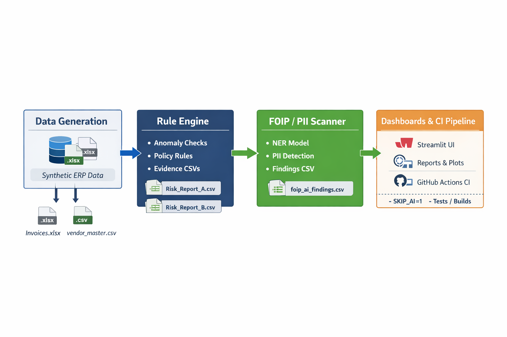

# 🏗️ System Architecture & Audit Pipeline (Project 2)

  

    
System

    
Procurement Audit Automation

    
Self-contained audit pipeline that converts ERP-style exports into audit-ready evidence: deterministic controls + optional FOIP/PII scanning + reproducible logs.

    

      ERP exports
      Deterministic controls
      Evidence exports
    

  

  

    
Outcome

    
Exceptions + evidence + traceability

    
Produces exception tables (ghost vendors, PO variance, high-value flags) and optional FOIP/PII findings, saved as timestamped evidence files for review workflows.

    

      CSV evidence
      Run logs
      Streamlit UI
    

  

---

## 1) System story

  

    
Why this exists

    
Numbers are only half the risk

    
Procurement risk typically shows up in vendor integrity (ghost/shell vendors), invoice vs PO mismatches (variance/overbilling patterns), and unstructured Notes that can leak FOIP/PII. This system treats the export as a fact source and produces auditor-usable outputs: exceptions, evidence files, and reproducible logs.

    

      Vendor integrity
      Budget variance
      FOIP/PII risk
    

  

---

## 2) End-to-end flow

  

    
Pipeline

    
Generate → Check → Scan → Export → Present

    
The pipeline is designed to mirror a real internal audit workflow: generate ERP-like exports, apply deterministic controls, optionally scan Notes for privacy risk signals, and export evidence artifacts for review.

    

      Generator
      Rule engine
      AI auditor
      Evidence
      Dashboard
    

  

  
ADD DIAGRAM IMAGE

  
Replace assets/architecture_flow.png with your exported diagram (keep filename stable for the page)

  

    
Order of operations

    
What happens during a run

    

      1) Data Generator creates a “dirty” ERP dump (<code>invoices.xlsx</code> + <code>vendor_master.csv</code>) 
      2) Rule Engine reads <code>config/audit_rules.yaml</code> and flags deterministic anomalies 
      3) AI Auditor scans unstructured <code>Notes</code> for FOIP/PII signals (optional in CI) 
      4) Evidence exports are written to <code>data/audit_reports/</code> (timestamped) 
      5) Streamlit Dashboard runs the audit and provides export buttons 
      6) CI runs the same flow but may skip AI for stability (<code>SKIP_AI=1</code>)
    

    

      Repeatable
      Timestamped evidence
      CI-aligned
    

  

---

## 3) Components (what each part does)

  

    
Input layer

    
ERP export simulation

    
<strong>Component:</strong> <code>src/data_generator.py</code> Produces a safe, realistic dataset without using real ERP data.

    

      Synthetic data
      Reproducible
      Public-safe
    

  

  

    
Outputs

    
Raw inputs (source artifacts)

    

      <code>data/raw_erp_dump/invoices.xlsx</code> 
      <code>data/raw_erp_dump/vendor_master.csv</code>
    

    

      ERP-like
      Demo-friendly
    

  

<strong>: why synthetic data is non-negotiable</strong>

  

    
Privacy-by-design

    
Same workflow, no data risk

    
Real procurement exports often contain personal emails, names, phone numbers, and contract context. Synthetic data enables a public demo of FOIP/PII detection while keeping the pipeline reproducible and reviewable without privileged access.

    

      Public-safe
      Reproducible runs
      No privileged access
    

  

---

  

    
Rules layer

    
Config-driven audit engine

    
<strong>Component:</strong> <code>src/rule_engine.py</code> Deterministic, explainable checks using pandas. Thresholds live in YAML for change control.

    

      Deterministic
      Explainable
      YAML policy layer
    

  

  

    
Checks

    
Current controls

    

      • Ghost vendors (VendorID missing in master) 
      • PO variance (<code>abs(invoice - po) / po</code> above threshold) 
      • High-value invoice flags (policy threshold)
    

    

      Anti-join
      Variance math
      Materiality
    

  

  

    
Evidence exports

    
Timestamped exception tables

    

      <code>data/audit_reports/ghost_vendors_&lt;TS&gt;.csv</code> 
      <code>data/audit_reports/po_variance_&lt;TS&gt;.csv</code> 
      <code>data/audit_reports/high_value_&lt;TS&gt;.csv</code> (if enabled/exported)
    

    

      Evidence artifacts
      Attach to review
      Repeatable
    

  

<strong>: why YAML rules matter in real organizations</strong>

  

    
Change control

    
Policy thresholds must be reviewable

    
Audit thresholds change and controls are sometimes toggled during transitions. YAML makes policy readable to non-developers, version-controlled via diffs, and reduces hidden logic inside code—supporting a clean approval trail.

    

      Reviewable diffs
      Lower regression risk
      Audit-friendly
    

  

---

  

    
AI layer

    
FOIP/PII scanner on Notes

    
<strong>Component:</strong> <code>src/ai_auditor.py</code> Flags privacy risk signals in unstructured text. Outputs evidence rows for human review.

    

      Probabilistic
      Assistive
      Evidence-first
    

  

  

    
Output

    
FOIP/PII findings evidence

    
<code>data/audit_reports/foip_ai_findings_&lt;TS&gt;.csv</code> (or your chosen naming)

    

      InvoiceID
      RiskContent
      DetectedFlags
    

  

<strong>: trust model — AI is assistive, not authoritative</strong>

  

    
Audit defensibility

    
AI produces triage signals + raw text evidence

    
Privacy/compliance workflows require human validation. The design stores the exact text snippet, the flags raised, and the invoice reference so a reviewer can verify context quickly.

    

      Human review
      Raw evidence text
      Clear traceability
    

  

---

  

    
Presentation layer

    
Streamlit dashboard

    
<strong>Component:</strong> <code>app/dashboard.py</code> One-screen UI: run audit, show pass/fail summary, inspect results, export evidence tables.

    

      Summary cards
      Tabs
      Downloads
    

  

  

    
Data behavior

    
Sample mode vs uploads

    
Sample mode loads from <code>data/raw_erp_dump/</code>. Upload mode accepts invoices and vendor master files directly through the UI.

    

      Sample toggle
      User uploads
    

  

  
ADD SCREENSHOT / VIDEO

  
Dashboard landing page + summary cards + export buttons (place assets in docs/assets/… and reference them here)

---

  

    
Orchestration

    
One command run

    
<strong>Component:</strong> <code>run_audit.sh</code> Single entry point that generates inputs, runs checks, exports evidence, runs tests, and writes logs.

    

      Reproducible
      Logged
      CI-aligned
    

  

  

    
CI stability

    
AI optional via SKIP_AI=1

    
CI validates deterministic controls and tests. AI can be skipped to avoid runner instability (downloads, torch/numpy mismatches). Local runs can include the full AI step.

    

      Stable builds
      Fast CI
      Full local demo
    

  

<strong>: why the AI step is optional in CI</strong>

  

    
Enterprise pattern

    
Stable controls in CI, heavier analysis in controlled environments

    
CI runners vary and model downloads can be flaky. The pipeline keeps deterministic controls and tests always-on, while AI analysis runs locally or in a controlled environment. This mirrors real compliance pipelines where stability comes first.

    

      Reliability-first
      Predictable CI
      Controlled AI runs
    

  

---

## 4) Trust boundaries & data handling

  

    
Boundary

    
Public repo vs sensitive data

    
Only synthetic data is generated and stored. Evidence tables are safe to publish because they are derived from synthetic inputs (no real procurement data).

    

      Public-safe
      Synthetic-only
    

  

  

    
Boundary

    
Rules vs AI

    
Rules are deterministic and repeatable. AI findings are triage signals for human review. Outputs include raw text evidence so reviewers can validate context.

    

      Deterministic rules
      Assistive AI
    

  

  

    
Boundary

    
Local demo vs CI environment

    
Local runs demonstrate the full pipeline (including AI). CI runs prioritize stability and can skip AI using <code>SKIP_AI=1</code>.

    

      Local = full demo
      CI = stable validation
    

  

---

## 5) Outputs (audit evidence map)

  

    
Artifacts

    
Where outputs land, and why they matter

| Output Type | Where it lands | Why it matters |
|---|---|---|
| Raw inputs | `data/raw_erp_dump/` | Reproducible “source” exports |
| Ghost vendors evidence | `data/audit_reports/ghost_vendors_<TS>.csv` | Vendor integrity exceptions |
| PO variance evidence | `data/audit_reports/po_variance_<TS>.csv` | Overbilling / mismatch evidence |
| High value evidence | `data/audit_reports/high_value_<TS>.csv` | Review prioritization (materiality) |
| FOIP/PII findings | `data/audit_reports/foip_ai_findings_<TS>.csv` | Privacy risk triage for review |
| Run logs | `data/audit_reports/run_logs/` | Traceability, debugging, audit trail |

  

  
ADD SCREENSHOT

  
data/audit_reports/ and data/audit_reports/run_logs/ after a successful run

---

## 6) Scalability roadmap (production-grade direction)

  

    
Data

    
Secure ERP integration

    
Replace generator with secure connectors (export jobs, service accounts, approved access). Keep evidence artifacts unchanged.

    

      Secure connectors
      Same evidence outputs
    

  

  

    
Privacy

    
Stronger FOIP/PII detection

    
Add phone/address patterns, stronger heuristics, and privacy-focused classifiers. Keep outputs as evidence-first exception lists.

    

      Phones/addresses
      Keywords
      Better precision
    

  

  

    
Rules

    
Modular control packs

    
Split rules into financial/vendor/approvals/delegation-limits. Keep YAML policy layer with versioned thresholds.

    

      Control packs
      YAML policy
    

  

  

    
Traceability

    
Run IDs + storage

    
Persist runs to SQLite/Postgres with run IDs, evidence references, and metadata. Improves lineage and audit replay.

    

      Run IDs
      Lineage
      Replay
    

  

  

    
Security

    
Role-based access

    
Dashboard authentication + restricted evidence exports to align with least privilege and internal compliance expectations.

    

      Auth
      Least privilege
    

  

  

    
Packaging

    
Containerized execution

    
Ship as a container for repeatable execution in standardized environments (local demo, controlled servers, enterprise runners).

    

      Docker
      Repeatable
    

  

