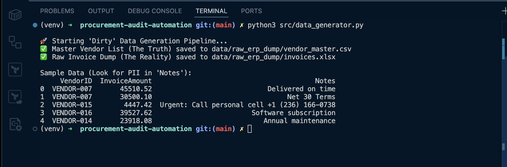
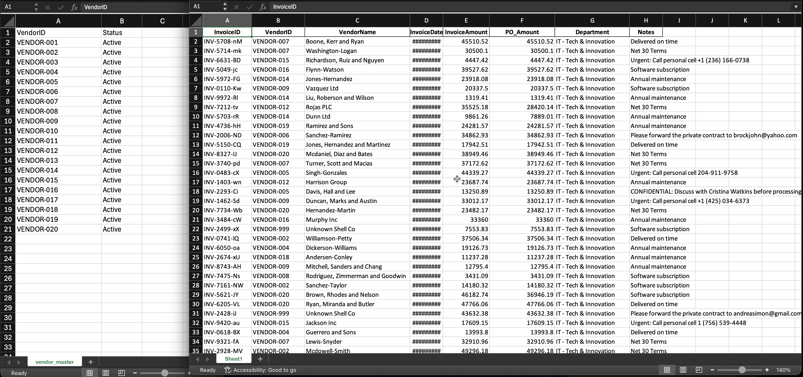
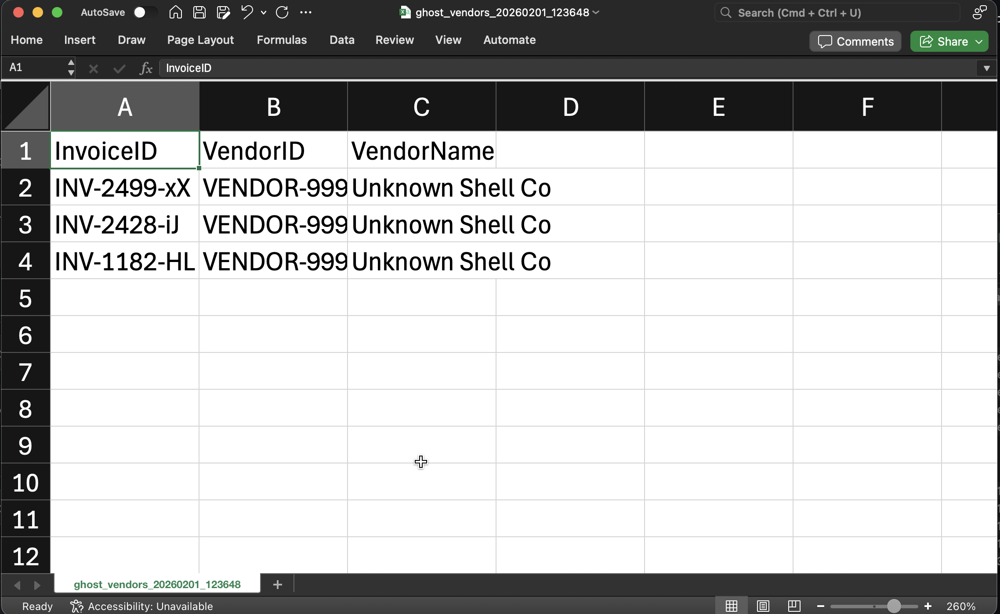
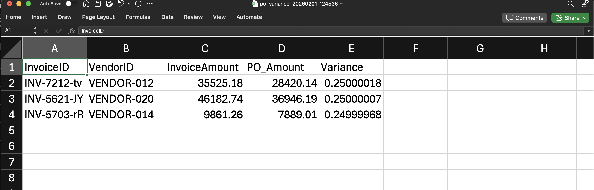
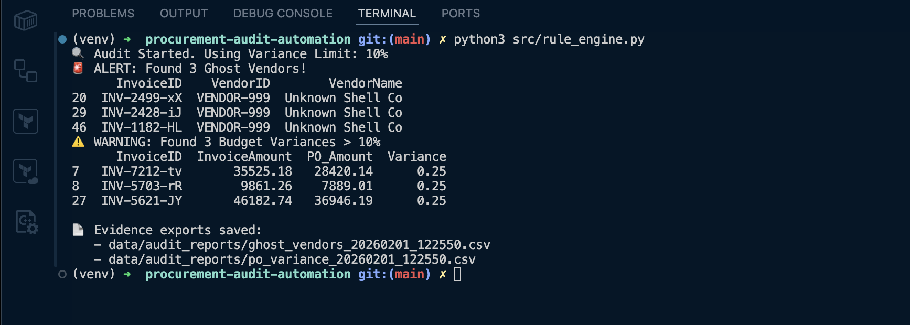
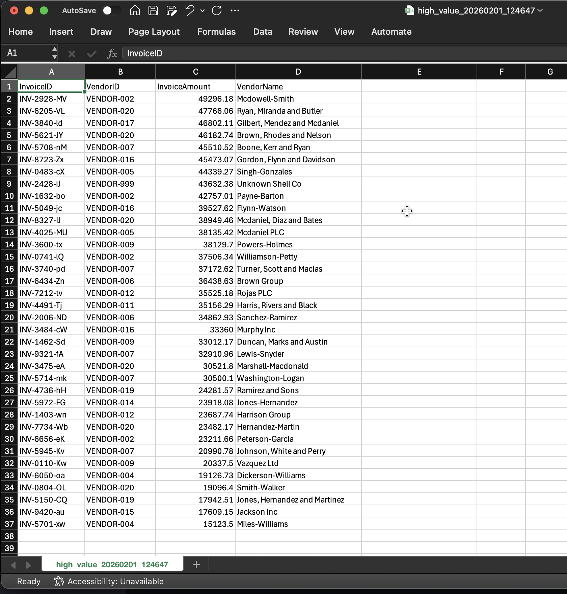
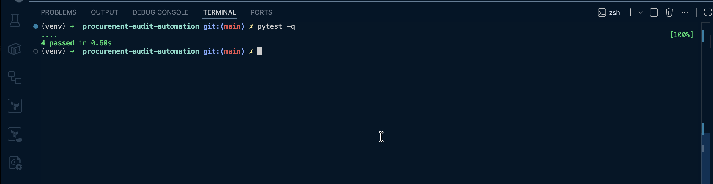
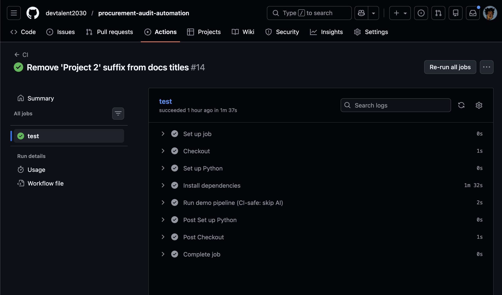

---

layout: default
title: Demo & Evidence Artifacts
permalink: /demo/
-----------------

# Demo & Evidence

This page documents the end-to-end demo flow for the project and links directly to the **actual clips, screenshots, inputs, and evidence exports already in this repo**.

---

## Demo Flow (5 short clips)

Each clip shows **one action + one result**.

---

## Clip A — Generate Dirty ERP Data

**Caption:** Generate ERP dump with seeded anomalies

**Command:**

```bash
python src/data_generator.py
```

### Outputs created

* [`data/raw_erp_dump/invoices.xlsx`](data/raw_erp_dump/invoices.xlsx)
* [`data/raw_erp_dump/vendor_master.csv`](data/raw_erp_dump/vendor_master.csv)

### What this clip shows

* Files created successfully
* Quick peek at the generated dataset (ghost vendor / PO mismatch seeded)

**Clip (image):**



**Screenshots:**

* 
* 
* 

---

## Clip B — Rule Engine Detects Exceptions

**Caption:** Config-driven rule engine detects ghost vendors & PO variance

**Command:**

```bash
python src/rule_engine.py
```

### Evidence exports (example run)

These are real files from the repo (timestamped):

* [`data/audit_reports/ghost_vendors_20260201_125633.csv`](data/audit_reports/ghost_vendors_20260201_125633.csv)
* [`data/audit_reports/po_variance_20260201_125633.csv`](data/audit_reports/po_variance_20260201_125633.csv)

### What this clip shows

* Rule engine summary output (counts)
* Evidence CSVs produced under `data/audit_reports/`

**Clip (image):**



**Screenshot:**

* 

---

## Clip C — FOIP/PII Scan (AI/NLP)

**Caption:** AI flags privacy risk inside unstructured Notes

**Command:**

```bash
python src/ai_auditor.py
```

### Evidence export (example run)

* [`data/audit_reports/foip_ai_findings_20260201_125633.csv`](data/audit_reports/foip_ai_findings_20260201_125633.csv)

### What this clip shows

* Findings printed during the scan
* Timestamped findings CSV written to `data/audit_reports/`

**Clip (image):**


**Short walkthrough (video):**

* [`assets/screenshots/c2-foip-evidence-csv.mp4`](assets/screenshots/c2-foip-evidence-csv.mp4)

---

## Clip D — Streamlit Dashboard

**Caption:** Dashboard summary + exportable evidence tables

**Command:**

```bash
streamlit run app/dashboard.py
```

### What this clip shows

* Summary cards (Ghost Vendors / PO Variance / High-Value / FOIP Findings)
* Export/download actions

**Clip (video):**

<video controls width="100%">
  <source src="assets/demo/clip-d-dashboard.mp4" type="video/mp4" />
  Your browser does not support the video tag.
</video>

**Dashboard UI walkthrough (video):**

* [`assets/screenshots/d1-dashboard-home.mp4`](assets/screenshots/d1-dashboard-home.mp4)

---

## Clip E — Tests & CI

**Caption:** Tests + CI confirm reliability

### Local unit tests

**Command:**

```bash
pytest -q
```

### CI evidence

**Clip (image):**



**Screenshot:**

* 

---

# Outputs

## Raw inputs

* [`data/raw_erp_dump/invoices.xlsx`](data/raw_erp_dump/invoices.xlsx)
* [`data/raw_erp_dump/vendor_master.csv`](data/raw_erp_dump/vendor_master.csv)

## Evidence exports

All saved under [`data/audit_reports/`](data/audit_reports/).

Representative evidence files already present:

* Ghost vendors: [`data/audit_reports/ghost_vendors_20260201_125633.csv`](data/audit_reports/ghost_vendors_20260201_125633.csv)
* PO variance: [`data/audit_reports/po_variance_20260201_125633.csv`](data/audit_reports/po_variance_20260201_125633.csv)
* High value: [`data/audit_reports/high_value_20260201_125633.csv`](data/audit_reports/high_value_20260201_125633.csv)
* FOIP/PII findings: [`data/audit_reports/foip_ai_findings_20260201_125633.csv`](data/audit_reports/foip_ai_findings_20260201_125633.csv)
* AI risk findings (aggregate): [`data/audit_reports/ai_risk_findings.csv`](data/audit_reports/ai_risk_findings.csv)

## Run logs

* [`data/audit_reports/run_logs/`](data/audit_reports/run_logs/)

---

## Related pages

* **Architecture Overview:** [architecture.md](architecture.md)
* **Audit Rule Engine Concepts:** [logic_engine_concepts.md](logic_engine_concepts.md)
* **Data Generator:** [data_generator.md](data_generator.md)
* **FOIP / PII Scanner:** [foip_pii_scanner.md](foip_pii_scanner.md)
* **Testing & CI:** [testing_ci.md](testing_ci.md)
